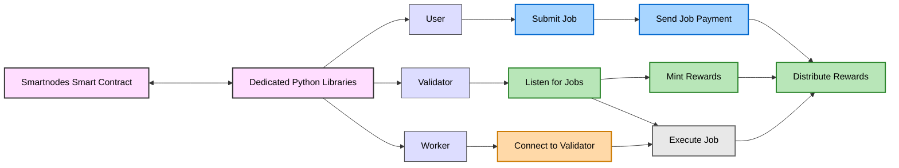

# Smartnodes: A Modular Decentralized Resource Sharing Network
###### Version 0.1 Oct 2025 (under active development) 

### Table of Contents

1. [Introduction](#1-introduction)
2. [Architecture](#2-architecture)
3. [Smart Contract System](#3-smart-contract-system)
4. [Tokenomics](#4-tokenomics)

---

### Abstract

Smartnodes represents an ecosystem of smart contract-secured peer-to-peer tools designed to harness distributed hardware 
worldwide for executing resource intensive tasks. It provides node software, secure job payments, and worker incentives 
needed to create peer-to-peer resource sharing applications, all under one modular ecosystem. This enables individuals 
to monetize their idle hardware capacity while providing researchers, developers, and organizations with access to advanced 
computational resources for data analysis, artificial intelligence development, and scientific research applications.

## 1. Introduction

The computational landscape has undergone a dramatic transformation driven by the exponential growth in artificial intelligence 
workloads, big data analytics, and complex scientific simulations. These resource-intensive applications demand unprecedented 
computational power and sophisticated data collection mechanisms, creating significant barriers for researchers, startups, and 
organizations with limited access to expensive infrastructure. Traditional centralized cloud computing platforms, while powerful, 
often impose substantial financial burdens, geographic limitations, and inherent vulnerabilities associated with single points of 
failure.

In response to these challenges, a revolutionary paradigm has emerged through the development of decentralized physical infrastructure 
networks (DePIN). This innovative approach leverages the collective power of distributed resources through peer-to-peer architectures, 
transforming how computational tasks are executed and data is collected. Notable examples of successful DePIN implementations include 
Helium's decentralized 5G and IoT networks, which have created global wireless coverage through community-owned infrastructure, and 
crowd-sourced mapping initiatives that utilize custom dash-cam equipment to generate comprehensive street-level geographic data.

Building upon these foundational concepts, Smartnodes advances the DePIN paradigm by establishing a versatile platform that enables 
the creation of multiple specialized networks for compute sharing and hardware utilization. Rather than focusing on a single use case, 
Smartnodes provides the infrastructure and tools to build diverse resource-sharing applications tailored to specific computational needs 
and hardware capabilities. This creates an ecosystem where token rewards flow only to networks that generate user demand, ensuring the 
network and native token continue to derive value from real utility.

## 2. Architecture

Smartnodes combines a smart contract system for rewards, reputation, and governance with a standardized node framework that simplifies 
secure peer-to-peer (P2P) resource sharing. This design optimizes for both scalability and security, enabling high-throughput computational 
workloads while maintaining security and economic incentives through blockchain infrastructure.

Smartnodes provides a Python-based node framework that handles all essential components for building resource-sharing networks. At the core 
of this is the smartnode python library, which manages data transmission between network participants, implements smart contract-secured 
handshakes for validator authentication, and maintains distributed data storage through Kademlia-inspired distributed hash tables. This 
ensures data availability, storage, and replication across the network without relying on centralized infrastructure. 

The network defines three distinct participant types, each serving specific functions within the ecosystem:

### Validators
Validators operate across all peer-to-peer networks and serve as the critical coordination layer. They provide API access to network 
resources, maintain network data integrity, and facilitate interactions between users and workers. Beyond these coordination functions, 
validators conduct proof-of-work verification on completed tasks and aggregate off-chain data for on-chain updates, including job 
completions and worker contributions. Since validators commit reward distributions and job completions on-chain, they maintain the 
active off-chain networks, and additions to the validator node framework can dynamically add and remove networks as needed.

### Workers
Workers are specialized nodes that execute computational tasks for users. They maintain continuous availability for job assignment and 
ensure efficient completion of user requests through validator coordination. The worker framework is designed to be flexible, allowing 
modifications to accommodate different job types and endpoint hardware configurations. 

### Users
Users interact with the network to access computational resources by submitting job requests through validators and establishing direct 
connections with workers for task execution. This architecture enables users to access pooled computational resources across the network without managing infrastructure directly.

Specialized networks built with these smart nodes cater to specific use cases, ranging from AI training to scientific computing. The modular 
design allows worker node configurations and job monitoring components to be modified to fit different job types and hardware requirements, 
enabling the platform to support diverse computational workloads without sacrificing efficiency or security.

The network implements comprehensive security measures to maintain service quality across all operations. Validators continuously monitor 
workers during task completion, with each network implementing custom proof-of-work verification and behavior monitoring tailored to its 
specific requirements. All network participants possess cryptographic key pairs that link their off-chain identity to smart contract interactions, 
ensuring authentic connections to reputable nodes and maintaining interaction security throughout the network. The system plans to implement 
on-chain reputation updates for both workers and validators to maintain quality standards over time. Users can request fault-tolerant queries or 
jobs through pipeline or worker replication, with potential future capabilities to route fault-tolerant queries on-chain, much like an oracle 
does. 

The off-chain aggregation process enables efficient data collection while maintaining decentralization. Validators collect and verify network data 
over defined periods, with random selection of validators each period to submit proposals on-chain containing this aggregated data. All validators 
then vote on submitted proposals, and the first proposal to receive 66% of active validator votes passes, triggering on-chain reward distribution 
for workers and validators. This mechanism balances efficiency with decentralized consensus, ensuring that network state updates reflect accurate 
off-chain activity.

## 3. Smart Contract System

Smart contracts handle payments, reputation updates, and governance decisions, providing immutable records and dispute resolution mechanisms. These contracts are deployed on Base, an Ethereum Layer 2 scaling solution that provides the scalability necessary for high-frequency network operations while maintaining security through Ethereum's established infrastructure. The ecosystem consists of four main contracts that work together to coordinate network operations.

### SmartnodesCoordinator

The SmartnodesCoordinator serves as a multi-signature contract controlled by collateralized validators that coordinate the updating of job information, worker participation, and rewards. At testnet launch, participation requires 1,000,000 SNO tokens as collateral, though this requirement is subject to adjustment based on network conditions and governance decisions. The Coordinator implements a periodically rotating validator set for enhanced security, preventing long-term capture of coordination functions by any single group. Its proposal creation and voting mechanism enables efficient off-chain data aggregation while maintaining decentralized consensus through a 66% approval threshold for state updates. When validators create proposals containing aggregated off-chain data including job completions, worker performance metrics, and network health indicators, other validators vote on the integrity of these proposals. Successful proposals that achieve greater than 66% approval trigger updates to the Core contract and automated token reward distribution to participating validators and workers.

### SmartnodesCore

The SmartnodesCore contract serves as the central repository for network state and access control mechanisms. It stores node credentials and reputation scores, enabling the network to maintain quality standards through transparent performance tracking. The Core contract implements access control for peer-to-peer communications, ensuring that only verified and reputable nodes can participate in sensitive network operations. Additionally, it processes job requests for large-scale computational tasks, coordinating resource allocation across the distributed network.

### SmartnodesERC20

The SmartnodesERC20 contract implements the standard ERC-20 token interface to facilitate network payments and incentives. Reward claims are processed through a Merkle proof claiming mechanism during Coordinator state updates, enabling efficient distribution of rewards to large numbers of participants without excessive gas costs. The token serves multiple functions within the ecosystem, including payment processing for network services, validator collateral management to ensure accountability, block reward distribution to incentivize continued participation, and governance participation through the SmartnodesDAO.

### SmartnodesDAO

The SmartnodesDAO enables decentralized governance for network upgrades and parameter adjustments, ensuring that the network can adapt to changing conditions and community needs without centralized control. Governance capabilities include fine-tuning of economic and technical parameters such as state update intervals and staking requirements, as well as upgrade capabilities for Core or Coordinator contracts. While the token contract is immutable to ensure economic predictability, the current testnet implementation allows Core contract upgrades to facilitate iterative development. Voting power within the DAO is proportional to token holdings, aligning governance influence with economic stake in the network's success.

## 4. Tokenomics

Smartnodes implements a carefully designed tokenomics model to ensure fair distribution and sustainable participant incentives. Reward emissions begin upon testnet launch, with any claimed rewards eligible for claiming on mainnet following the network's production deployment. This approach allows early participants to earn rewards while helping test and secure the network before full mainnet launch.

Rewards are emitted periodically and follow a yearly 40% reduction in the emission rate until reaching a tail emission. This emission schedule was chosen to balance early participant rewards with long-term sustainability, ensuring continued incentives for network participants to operate nodes even when processing free jobs. The declining emission rate prevents excessive inflation while maintaining sufficient rewards to attract and retain network participants as the platform matures.

The initial token distribution allocates tokens to genesis nodes, with each genesis node receiving the minimum collateral requirement for validator operation. The three genesis nodes each receive 1,000,000 SNO tokens, totaling 3,000,000 SNO in the initial distribution. This genesis allocation bootstraps the network with sufficient validator capacity to handle initial coordination and consensus functions.

State update rewards begin at 45,000 tokens per state update, with updates occurring at 8-hour intervals. This reward structure 
compensates validators for their coordination work and the computational resources required to aggregate off-chain data and maintain 
network state. The emission rate reduces by 40% every approximately 12 months, gradually decreasing the inflation rate as the network 
matures and transaction fees potentially supplement validator income. After the series of reduction periods, the emission rate reaches a 
tail emission of 3,360 tokens per state update, leading to a perpetually decreasing inflation rate starting at ~2%. This tail emission 
ensures perpetual incentives for network participation while maintaining a predictable long-term token supply trajectory. The emission 
model creates a balanced economic environment that rewards active network participation during the growth phase while transitioning to 
sustainable long-term incentives that preserve token value for all stakeholders.

